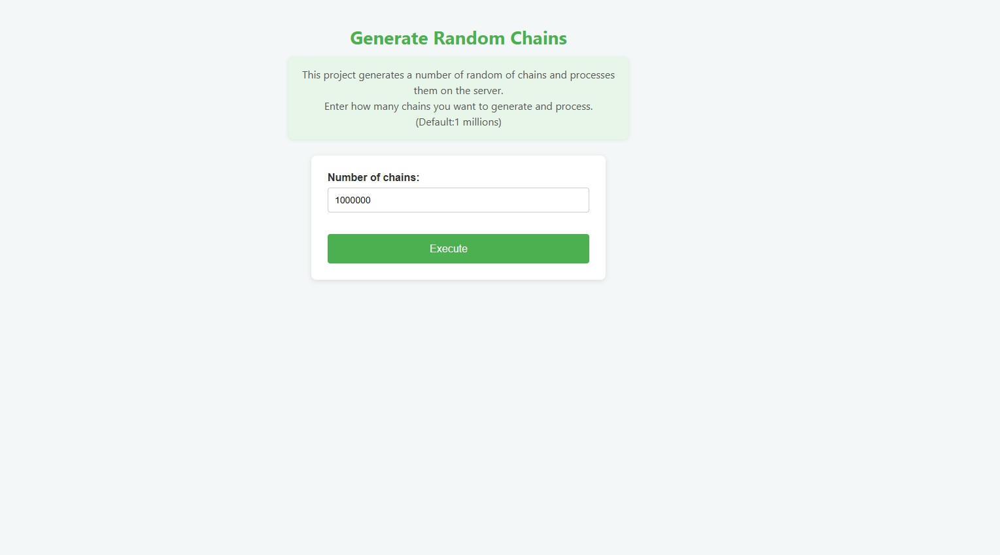
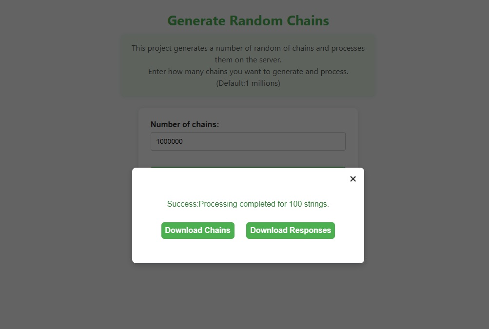

# Avangenio Test Exercise Version 1.0

### Steps to run the application:

#### First Variant (Recommended):

- Run the application with Docker. In this case, a small HTML page was implemented to simulate a real-world scenario
  with a client and a server.
- If you have the `make` command installed, you can run `make build` from the project root folder.
- Otherwise, you can run `docker-compose up --build -d` from the project root folder to compile and start the containers
  without lock the terminal.
- After you can access to [Generate Ramdom Chains](http://localhost:5000)
- The main page look like this: 
- After **Execute** the application a popup dialog to download the chain and response file is
  displayed 
- The file chains.txt is located at the path `client/data/chains.txt`.
- The file responses.txt is located at the path `client/data/responses.txt`.
- The file client.log is located at the path `client/logs/client.log`.
- The file server.log is located at the path `server/logs/server.log`.

#### Second Variant:

- Move to server folder and run the command `python server.py`
- Move to client folder and run the command `python client.py`
- Enter the amount of chains to generate

